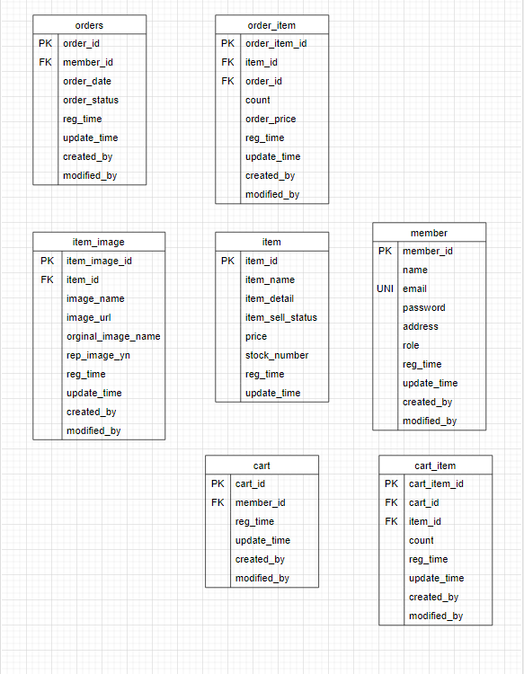

# 간단한 쇼핑몰 만들어보기

***

1. 엔티티 
   
2. Repository 설계 -> **jpa , QueryDLS**
3. Spring security 설정
   * **Deprecated** 
     * WebSecurityConfigurerAdapter
       * 공식문서 : https://spring.io/blog/2022/02/21/spring-security-without-the-websecurityconfigureradapter
       * 참조 블로그 : https://www.baeldung.com/spring-deprecated-websecurityconfigureradapter
     
***

###기능
* 간단한 로그인 , 로그아웃
* 물건 등록하기
  * 이미지 업로드
* 장바구니
* 주문하기